<p align="center">
  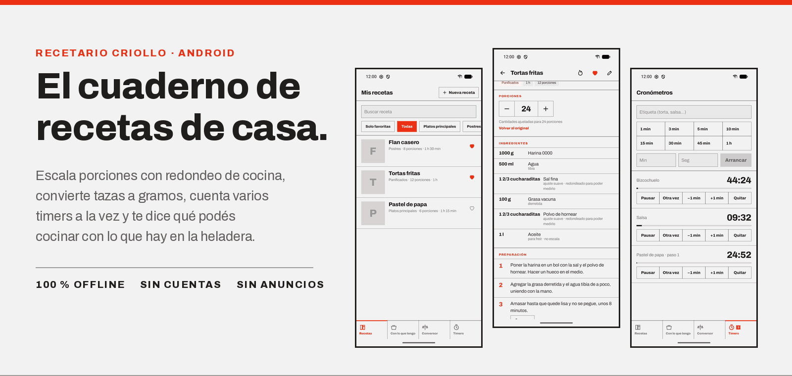
</p>

<h1 align="center">Recetario Criollo</h1>

<p align="center">
  <b>El cuaderno de recetas de casa, en el teléfono.</b><br>
  Escala porciones con redondeo de cocina, convierte tazas a gramos, cuenta varios timers a la vez<br>
  y te dice qué podés cocinar con lo que hay en la heladera.
</p>

<p align="center">
  
  
  
  
  
</p>

---

**Sin backend, sin internet, sin cuentas, sin anuncios.** Todo (recetas, fotos, catálogo y cronómetros) vive en el teléfono. Pensada para usar en la mesada, con las manos ocupadas: botones grandes, poco scroll para lo frecuente y un modo cocina que no deja apagar la pantalla.

## Contenido

- [Recorrido por la app](#recorrido-por-la-app)
  - [Mis recetas](#-mis-recetas)
  - [Detalle y escalador de porciones](#-detalle-y-escalador-de-porciones)
  - [Cocinar paso a paso](#-cocinar-paso-a-paso)
  - [Historial de cocinadas](#-historial-de-cocinadas)
  - [Alta y edición guiada](#-alta-y-edición-guiada)
  - [Con lo que tengo](#-con-lo-que-tengo)
  - [Conversor de medidas](#-conversor-de-medidas)
  - [Cronómetros](#-cronómetros)
  - [Tema oscuro y modo cocina](#-tema-oscuro-y-modo-cocina)
- [Cómo funciona por dentro](#cómo-funciona-por-dentro)
- [Sistema de diseño](#sistema-de-diseño)
- [Arquitectura](#arquitectura)
- [Compilar y probar](#compilar-y-probar)
- [Privacidad y permisos](#privacidad-y-permisos)
- [Estado del proyecto](#estado-del-proyecto)

---

## Recorrido por la app

La app se organiza en cuatro solapas fijas abajo: **Recetas**, **Con lo que tengo**, **Conversor** y **Timers**. La solapa de timers lleva un globo con la cantidad de cronómetros vivos, así se ve desde cualquier pantalla que hay algo en el fuego.

### ▍ Mis recetas

<table>
  <tr>
    <td width="36%">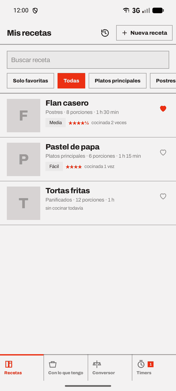</td>
    <td>

- Cada fila muestra **foto o inicial**, nombre, categoría, porciones y tiempo, y debajo la **dificultad**, las **estrellas** promedio y cuántas veces la cocinaste.
- **Buscador** por nombre que ignora tildes y mayúsculas, igual que el selector de ingredientes: «azucar» encuentra *Azúcar*.
- **Filtros** rectangulares: *Solo favoritas*, *Todas* y las categorías que tengan recetas (entradas, platos principales, guarniciones, sopas y guisos, postres, panificados, salsas, bebidas, conservas…).
- **Favoritas** con un toque en el corazón; quedan primeras en la lista.
- La app arranca con tres clásicas para ver cómo funciona: *Tortas fritas*, *Pastel de papa* y *Flan casero*.

</td>
  </tr>
</table>

### ▍ Detalle y escalador de porciones

<table>
  <tr>
    <td width="33%">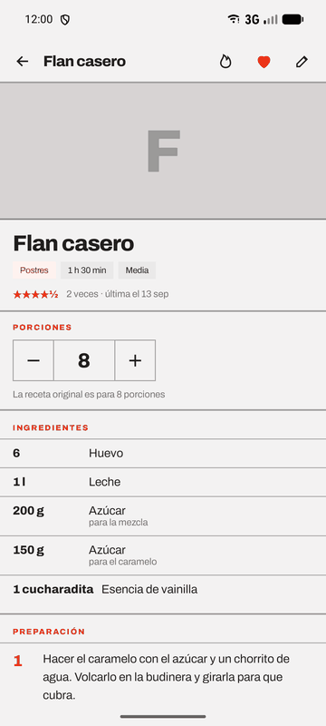</td>
    <td width="33%">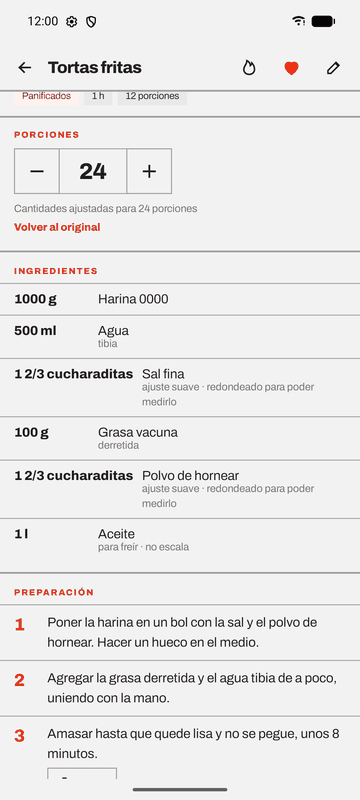</td>
    <td width="33%">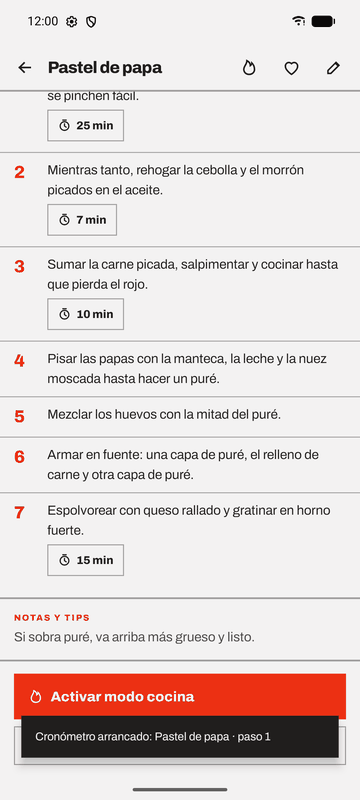</td>
  </tr>
  <tr>
    <td><sub>Ficha con categoría, tiempo, dificultad y cómo salió las veces anteriores.</sub></td>
    <td><sub>De 12 a 24 porciones: la sal sube menos y el aceite no escala.</sub></td>
    <td><sub>Cada paso con tiempo sugerido arranca su propio timer.</sub></td>
  </tr>
</table>

- **Stepper de porciones** de 52 dp: todas las cantidades se recalculan al instante y **Volver al original** deshace el cambio.
- Cada ingrediente aclara cuando **no escala**, lleva **ajuste suave** o se **redondeó para poder medirlo**.
- Cantidades en lenguaje de cocina: `1 2/3 cucharaditas`, `1/2 taza`, `250 g`, `a gusto`.
- **Timer desde el paso**: queda etiquetado «Pastel de papa · paso 1» y avisa aunque salgas de la app.
- **Cocinar paso a paso** como acción principal, con las porciones que estás viendo.
- **Modo cocina** (🔥): pantalla siempre encendida y letra un 25 % más grande, sin salir del detalle.
- Editar, marcar favorita y borrar con confirmación.

### ▍ Cocinar paso a paso

<table>
  <tr>
    <td width="33%">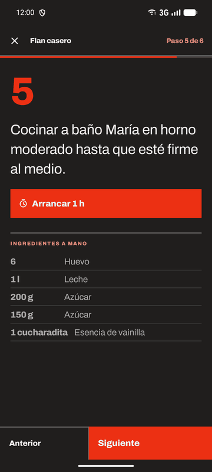</td>
    <td width="33%">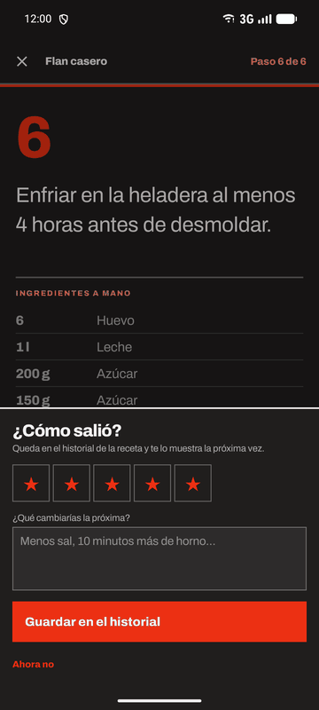</td>
    <td>

Pantalla completa y oscura para cocinar con el teléfono apoyado en la mesada:

- **Un paso por pantalla**, número gigante y texto a 27 sp. Se avanza con **Anterior / Siguiente** o deslizando.
- **Arrancar 1 h**: el timer sugerido del paso, a un toque. Los timers en marcha se ven debajo con su cuenta.
- **Ingredientes a mano** con las cantidades escaladas, y **primero los que nombra el paso** («batir los huevos con el azúcar» sube *Huevo* y *Azúcar*).
- La pantalla no se apaga mientras estás cocinando.
- En el último paso, **Terminé** pregunta **¿Cómo salió?**: estrellas y qué cambiarías la próxima vez.

</td>
  </tr>
</table>

### ▍ Historial de cocinadas

<table>
  <tr>
    <td width="33%">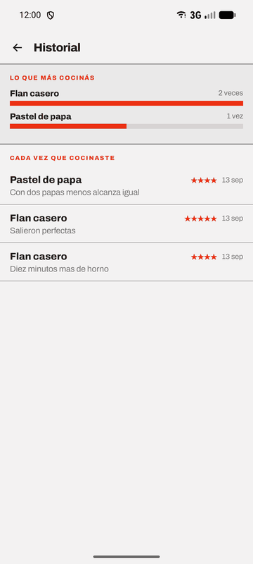</td>
    <td width="33%">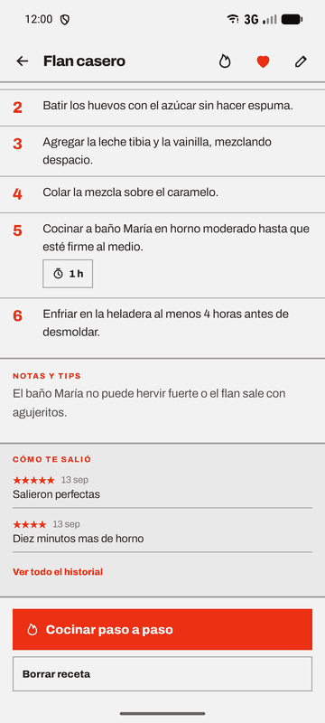</td>
    <td>

- **Lo que más cocinás**: las tres recetas más hechas, con barras proporcionales.
- **Cada vez que cocinaste**: receta, estrellas, fecha y nota. Tocás una y abre la receta; manteniendo apretado la borrás.
- En el detalle de cada receta, **Cómo te salió** muestra las dos últimas notas justo antes de volver a cocinarla.
- Se entra desde el ícono de reloj de *Mis recetas* o desde el detalle.

</td>
  </tr>
</table>

### ▍ Alta y edición guiada

<table>
  <tr>
    <td width="36%">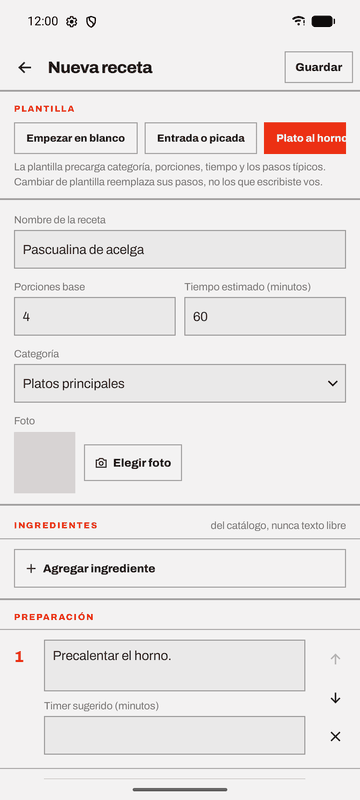</td>
    <td width="36%">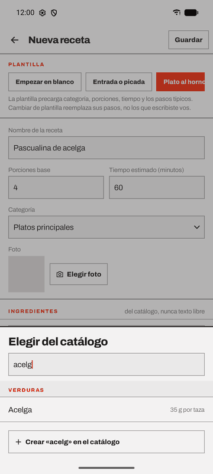</td>
    <td>

**Plantillas por tipo de plato** que precargan categoría, porciones, tiempo y pasos típicos:

| Plantilla | Porc. | Tiempo | Pasos |
| --- | :-: | :-: | :-: |
| Entrada o picada | 4 | 20 min | 3 |
| Plato al horno | 4 | 60 min | 5 |
| Guiso u olla | 6 | 75 min | 5 |
| Postre | 8 | 60 min | 5 |
| Panificado con levadura | 12 | 150 min | 6 |

Cambiar de plantilla reemplaza **sus** pasos y respeta los que escribiste vos.

</td>
  </tr>
</table>

- **Ingredientes del catálogo, nunca texto libre.** El selector filtra la lista agrupada por categoría y, si el ingrediente no existe, lo das de alta ahí mismo (nombre, categoría, unidad, gramos por taza y si es sal, especia o leudante).
- Por ingrediente: **cantidad** como la escribís (`250`, `2,5`, `1/2`, `1 1/2`), **unidad**, **regla de escalado** (sugerida sola) y **aclaración** («en cubos», «tibia»). Una cantidad ilegible no se guarda: te dice cuál corregir.
- **Dificultad** (Fácil / Media / Difícil) y **molde redondo** en cm, ambos opcionales.
- **Pasos** con timer sugerido en minutos, para subir, bajar o quitar.
- **Foto opcional** desde la galería del sistema, sin pedir permiso de almacenamiento: se copia reducida a la carpeta privada de la app.

### ▍ Con lo que tengo

<table>
  <tr>
    <td width="36%">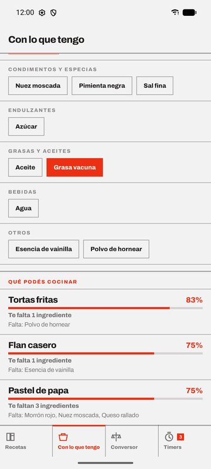</td>
    <td>

Tildás lo que hay en casa y aparecen las recetas **ordenadas por porcentaje de coincidencia**.

- Los ingredientes se eligen en **chips agrupados por categoría**, con solo los que usa alguna receta.
- Cada resultado dice **«Te da para hacerla»**, **«Te falta 1 ingrediente»** o **«Te faltan N»**, y **qué** falta.
- **«Doy por hecho sal, agua y aceite»** cuenta los básicos de despensa como disponibles.
- Como todo sale del catálogo, el cruce es exacto por id: no hay sinónimos ni errores de tipeo que resolver.

</td>
  </tr>
</table>

### ▍ Conversor de medidas

<table>
  <tr>
    <td width="33%">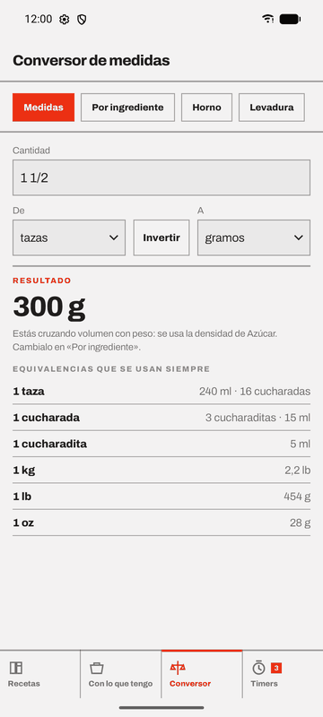</td>
    <td width="33%">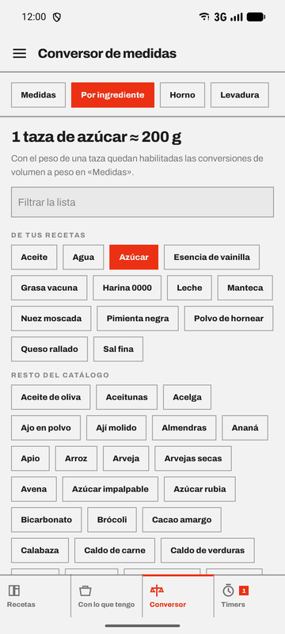</td>
    <td width="33%">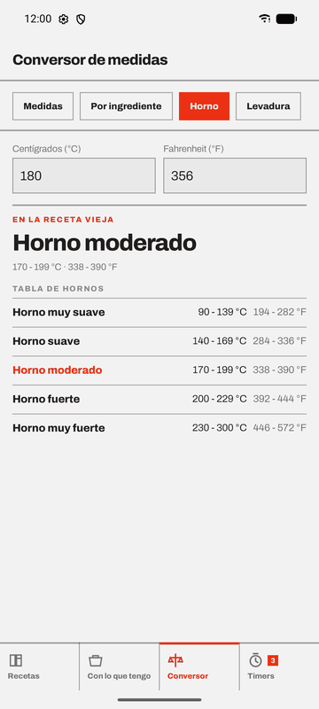</td>
  </tr>
  <tr>
    <td><sub><b>Medidas</b>: 1 1/2 tazas de azúcar son 300 g.</sub></td>
    <td><sub><b>Por ingrediente</b>: cuánto pesa una taza de cada cosa.</sub></td>
    <td><sub><b>Horno</b>: °C ↔ °F y «horno moderado» en grados.</sub></td>
  </tr>
</table>

| Pestaña | Qué resuelve |
| --- | --- |
| **Medidas** | ml, l, cucharadita, cucharada, taza ↔ g, kg, oz, lb. Si cruzás volumen con peso usa la densidad del ingrediente elegido; sin ingrediente **no inventa un número**. Tabla fija de equivalencias de todos los días. |
| **Por ingrediente** | Elegís entre los ingredientes con densidad cargada y ves «1 taza de azúcar ≈ 200 g». |
| **Horno** | Conversión en vivo en los dos sentidos y referencias de recetarios viejos: muy suave (90–139 °C), suave, moderado (170–199 °C), fuerte y muy fuerte (230–300 °C). |
| **Levadura** | Fresca ↔ seca con la regla de la abuela: la seca es un tercio de la fresca. |

### ▍ Cronómetros

<table>
  <tr>
    <td width="36%">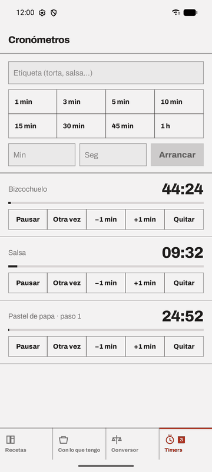</td>
    <td>

- **Varios a la vez**, cada uno con su etiqueta.
- **Atajos** de 1, 3, 5, 10, 15, 30 y 45 min y 1 h, o tiempo a medida en minutos y segundos.
- Por cronómetro: **Pausar / Seguir**, **Otra vez**, **−1 min**, **+1 min** y **Quitar**.
- **Avisan con la app cerrada**: notificación con sonido de alarma y vibración.
- **Sobreviven al cierre y al reinicio**: se guarda el instante de fin, no los segundos que faltan; al prender el teléfono se reprograman y avisan los que vencieron apagado.
- Si el sistema no permite alarmas exactas, la pantalla ofrece concederlo; mientras tanto el timer suena igual, con un margen de hasta unos minutos si el teléfono está en reposo.

</td>
  </tr>
</table>

### ▍ Tema oscuro y modo cocina

<table>
  <tr>
    <td width="33%">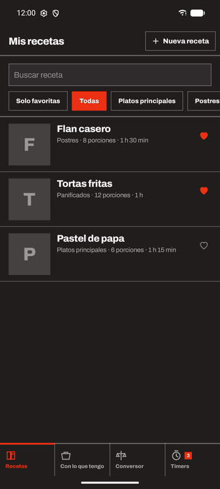</td>
    <td width="33%">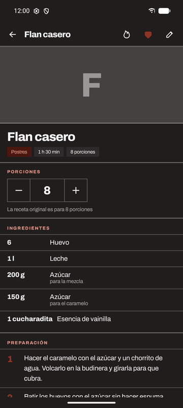</td>
    <td width="33%">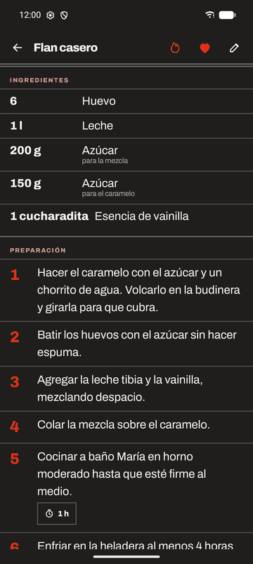</td>
  </tr>
  <tr>
    <td colspan="2"><sub>El tema sigue al del sistema, con la misma paleta invertida.</sub></td>
    <td><sub>Modo cocina: letra +25 % y pantalla encendida.</sub></td>
  </tr>
</table>

---

## Cómo funciona por dentro

### Escalado: no todo sube igual

Cada ingrediente de cada receta tiene su regla. El factor es `porciones deseadas ÷ porciones base`.

| Regla | Fórmula | Para qué | Ejemplo al duplicar |
| --- | --- | --- | --- |
| **Proporcional** | `cantidad × factor` | Casi todo | 500 g → 1000 g |
| **Ajuste suave** | `cantidad × factor^0,75` | Sal, especias, levadura | 1 cdta → 1 2/3 cdta (+68 %) |
| **No escala** | `cantidad` | Aceite para freír, azúcar del caramelo | 1 l → 1 l |

### Redondeo para medir de verdad

Nadie mide «2,3333 huevos» ni «213,7 g de harina».

| Unidad | Cómo redondea | Ejemplo |
| --- | --- | --- |
| taza, cucharada, cucharadita, unidad, litro | A la fracción útil más cercana: 1/4, 1/3, 1/2, 2/3, 3/4 (desde 10, de a medios) | `2,3333` → **2 1/3** |
| gramos y mililitros | Escalones de 0,5 · 1 · 5 · 25 según el tamaño | `213,4 g` → **215 g** |
| kg y litros · oz y lb | De a 0,05 · de a 0,25 | `1,23 kg` → **1,25 kg** |

Si el redondeo deja en cero algo que la receta lleva, se muestra el mínimo medible. El **conversor**, en cambio, no redondea a escalones de cocina: muestra decimales significativos (`1 cucharadita = 0,005 l`).

### Coincidencia de ingredientes

```
coincidencia = ingredientes distintos que tenés ÷ ingredientes distintos de la receta
```

Un ingrediente repetido en la receta (harina para la masa y para estirar) cuenta una sola vez. Los resultados se ordenan por porcentaje, después por menos faltantes y después por nombre.

### Cronómetros confiables

- Mientras corre, un cronómetro guarda **el instante en que termina**. Cerrar la app, apagar la pantalla o que Android mate el proceso no le mueve la cuenta.
- La alarma se programa con `AlarmManager.setAlarmClock` si el sistema permite alarmas exactas (`SCHEDULE_EXACT_ALARM`, que desde Android 13 arranca denegado). Si no, con `setAndAllowWhileIdle`, y con la app abierta el aviso sale igual desde el propio gestor.
- Android borra las alarmas al reiniciar y al actualizar la app: `ReceptorArranque` las vuelve a programar y avisa una vez por los timers que vencieron con el teléfono apagado.
- Los timers no se incluyen en la copia de seguridad: restaurados en otro momento no tendrían sentido.

---

## Sistema de diseño

La interfaz sigue el sistema **Modernist** del prototipo hecho en Claude Design: editorial, recto y de alto contraste, pensado para leerse de lejos.

| Token | Claro | Oscuro | Uso |
| --- | --- | --- | --- |
| Papel | `#F3F2F2` | `#201E1D` | Fondo |
| Papel hundido | `#EAE9E9` | `#2D2B2B` | Campos y cabeceras de grupo |
| Tinta | `#201E1D` | `#F3F2F2` | Texto y filetes (al 40 %) |
| Acento | `#EC3013` | `#EC3013` | Acción principal, selección, números de paso |
| Acento tenue | `#FFF2EF` | `#4D170E` | Etiquetas y avisos |

- **Tipografía:** [Archivo](https://github.com/Omnibus-Type/Archivo) 400 / 600 / 800, empaquetada como fuente variable (OFL, ver `docs/licencias/`). Títulos en 800 con *tracking* negativo; rótulos de sección en mayúsculas de 10 sp espaciadas.
- **Forma:** cero radios. Nada de tarjetas: filas separadas por filetes de 1 dp y secciones por filetes de 2 dp.
- **Componentes propios** en [`ui/componentes/Comunes.kt`](app/src/main/java/uy/horacio/recetariocriollo/ui/componentes/Comunes.kt): `BarraSuperior`, `ChipRecto`, `BotonPrimario`, `BotonSecundario`, `CampoTexto`, `SelectorDesplegable`, `Stepper`, `Casilla`, `BarraProgreso`, `Rotulo`. Los iconos de trazo salen de los SVG del prototipo.

---

## Arquitectura

App de un solo módulo, **MVVM** con `StateFlow` y **Repository** sobre Room. La lógica con matemática vive en Kotlin puro, sin Android, y es la que está cubierta por tests.

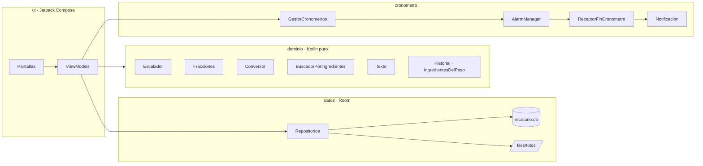

```
app/src/main/java/uy/horacio/recetariocriollo/
├── dominio/       Escalador, Fracciones, Conversor, BuscadorPorIngredientes, Texto, Historial,
│                  IngredientesDelPaso, Plantillas, modelo/
├── datos/         Entidades, DAOs y migraciones de Room, repositorios, catálogo semilla, fotos
├── cronometro/    Gestor de timers, alarma del sistema y notificación
└── ui/            Pantallas Compose, un ViewModel por pantalla, tema y componentes
```

**Decisiones que conviene recordar**

- **El catálogo de ingredientes es normalizado.** Las recetas referencian ingredientes por id; el alta desde el editor deduplica ignorando mayúsculas y tildes.
- **La UI nunca toca DAOs ni entidades**: habla con repositorios y modelos de dominio.
- **Volumen ↔ peso necesita densidad.** Sin gramos por taza, `Conversor.convertir` devuelve `null` en vez de inventar.
- **Migraciones escritas a mano.** Nunca `fallbackToDestructiveMigration`: son recetas de la gente. Cada versión exporta su esquema a `app/schemas` y tiene su test instrumentado (hoy la base va por la **versión 2**: dificultad, molde e historial de cocinadas).
- **Sin inyección de dependencias de terceros**: un contenedor hecho a mano en `RecetarioApp` alcanza para una app de este tamaño.

| | |
| --- | --- |
| Lenguaje | Kotlin 2.2 · KSP |
| UI | Jetpack Compose · Material 3 · Navigation con rutas tipadas |
| Datos | Room 2.8 · kotlinx.serialization · Coil 3 para fotos locales |
| Build | AGP 9.3 · Gradle 9.5 · compileSdk / targetSdk 37 · minSdk 26 |

---

## Compilar y probar

Requiere JDK 17 o superior y `platforms;android-37` en el SDK. Si `java` no está en el `PATH`, apuntá `JAVA_HOME` al JDK antes de usar Gradle.

```bash
./gradlew :app:assembleDebug        # APK de desarrollo
./gradlew :app:testDebugUnitTest    # tests de dominio, formateo, editor y cronómetros
./gradlew :app:connectedDebugAndroidTest   # migraciones y DAOs, con un emulador conectado
./gradlew :app:installDebug         # instalar en el teléfono o emulador conectado
./gradlew :app:bundleRelease        # AAB para Play, con R8
```

- La versión de desarrollo se instala con el sufijo `.debug`, así conviven la de desarrollo y la publicada.
- La firma de release se lee de `keystore.properties`, que **no** va al repo (ver `keystore.properties.ejemplo`). Sin ese archivo el release se arma igual, sin firmar.
- El release corre con R8 (`minify` + `shrinkResources`): **hay que probarlo instalado** antes de subirlo, porque que compile no alcanza.

**Integración continua:** cada push a `main` y cada PR corren en GitHub Actions dos jobs: tests unitarios, `lintRelease` y build de debug (el APK queda como artefacto), y los tests instrumentados en un emulador API 34.

**Tests unitarios (57):** `EscaladorTest`, `FraccionesTest`, `ConversorTest`, `BuscadorPorIngredientesTest`, `TextoTest`, `HistorialTest`, `IngredientesDelPasoTest`, `CronometroTest`, `LineaIngredienteTest` y `PlantillaEditorTest`.
**Instrumentados (3):** `MigracionesTest` y `CocinadaDaoTest`.

---

## Privacidad y permisos

La app no tiene acceso a internet: no declara el permiso y no incluye librerías de analítica, publicidad ni Firebase.

| Permiso | Para qué | Si no se da |
| --- | --- | --- |
| `POST_NOTIFICATIONS` | Avisar cuando termina un cronómetro | El timer corre, pero no avisa con la app cerrada |
| `SCHEDULE_EXACT_ALARM` | Que la alarma suene en el segundo justo | Suena igual, con posible demora en reposo |
| `RECEIVE_BOOT_COMPLETED` | Reprogramar los timers en marcha después de reiniciar | Un timer andando no avisa si se reinicia el teléfono |
| `VIBRATE` | Vibrar con el aviso | — |

Las fotos se eligen con el selector del sistema, sin permiso de almacenamiento. La copia de seguridad de Android incluye la base y las fotos, nunca los cronómetros.

---

## Estado del proyecto

| Fase | Alcance | Estado |
| :-: | --- | :-: |
| 1 | Proyecto, esquema Room y CRUD de recetas | ✅ |
| 2 | Escalador de porciones con reglas y redondeo | ✅ |
| 3 | Conversor de medidas y densidades | ✅ |
| 4 | Cronómetros múltiples con notificación | ✅ |
| 5 | Catálogo normalizado y búsqueda por ingredientes | ✅ |
| 6 | Generador guiado con plantillas | ✅ |
| 7 | Ícono, release con R8, rediseño Modernist | 🔄 Falta prueba en dispositivo real y alta en Play Console |
| 8.1 | Cocinar: paso a paso, «¿Cómo salió?», historial, dificultad y estrellas | ✅ |
| 8.2 | Cajón lateral, catálogo editable y ajustes | 📝 Próxima |
| 8.3 | Ajuste por molde y sustituciones de ingredientes | 📝 |
| 8.4 | Colecciones y etiquetas, planificador semanal y lista de compras por góndola | 📝 |
| 8.5 | Compartir e importar recetas, PDF y copia de seguridad | 📝 |

Cada fase tiene su [milestone](https://github.com/hsosa09/recetario-criollo/milestones), y los defectos y mejoras se siguen en [Issues](https://github.com/hsosa09/recetario-criollo/issues).

---

<p align="center">
  <sub>Hecho en Uruguay 🇺🇾 · textos en español rioplatense · tipografía Archivo bajo SIL Open Font License</sub>
</p>
